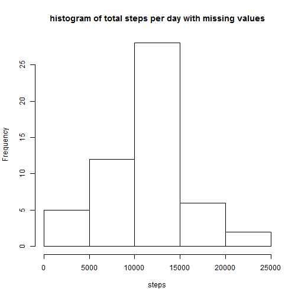

# Reproducible Research: Peer Assessment 1
========================================================


## Loading and preprocessing the data

```r
activity <- read.csv("activity.csv", na.strings = "NA")
head(activity)
```

  steps       date interval
1    NA 2012-10-01        0
2    NA 2012-10-01        5
3    NA 2012-10-01       10
4    NA 2012-10-01       15
5    NA 2012-10-01       20
6    NA 2012-10-01       25

```r
dates <- activity$date
dates <- as.Date(as.character(dates), "%Y-%m-%d")
str(dates)
```

 Date[1:17568], format: "2012-10-01" "2012-10-01" "2012-10-01" "2012-10-01" ...

```r
activity$date <- dates
```


## What is mean total number of steps taken per day?

```r
sum_steps <- sapply(split(activity, activity$date), function(d) {
    sum(d$steps)
})
hist(sum_steps, main = "histogram of total steps per day with missing values", 
    xlab = "steps")
```

 

```r

mean <- mean(sum_steps, na.rm = TRUE)
median <- median(sum_steps, na.rm = TRUE)
```

Mean total number of steps taken per day is 1.0766 &times; 10<sup>4</sup>
Median total number of steps taken per day is 10765

## What is the average daily activity pattern?

```r
library(ggplot2)
qplot(interval, steps, data = activity, stat = "summary", fun.y = "mean", geom = "line")
```

```
## Warning: Removed 2304 rows containing missing values (stat_summary).
```

 

```r
interval_steps <- sapply(split(activity, activity$interval), function(d) {
    mean(d$steps, na.rm = TRUE)
})
mstep <- which.max(interval_steps)
```

Interval 835 has the maximum value 206.1698.

## Imputing missing values
The strategy is to replace NA with the average steps of that interval across days, which are computed above.

```r
sum(is.na(activity$steps))
```

[1] 2304

```r
activity_fill <- data.frame(activity)
for (i in 1:dim(activity)[1]) {
    if (is.na(activity$steps[i])) {
        activity_fill$steps[i] <- interval_steps[as.character(activity$interval[i])]
    }
}
sum(is.na(activity_fill$steps))
```

[1] 0

```r

sum_steps_fill <- sapply(split(activity_fill, activity_fill$date), function(d) {
    sum(d$steps)
})
hist(sum_steps_fill, main = "histogram of total steps per day after filling missing values", 
    xlab = "steps")
```

 

The mean and median of the total daily number of steps are:

```r
mean(sum_steps_fill)
```

[1] 10766

```r
median(sum_steps_fill)
```

[1] 10766


These values does not differ much from the estimates from the first part of the assignment. Imputing missing data seems to have no obvious effect on the estimates of the total daily number of steps slightly.


## Are there differences in activity patterns between weekdays and weekends?

```r
Sys.setlocale(locale = "C")
```

[1] "C"

```r
weekday <- weekdays(activity_fill$date)
for (i in 1:length(weekday)[1]) {
    if (weekday[i] %in% c("Sunday", "Saturday")) {
        weekday[i] <- TRUE
    } else weekday[i] <- FALSE
}
str(weekday)
```

 chr [1:17568] "FALSE" "FALSE" "FALSE" "FALSE" "FALSE" ...

```r

activity_fill$weekday <- factor(weekday, labels = c("weekday", "weekend"))
qplot(interval, steps, data = activity_fill, stat = "summary", fun.y = "mean", 
    geom = "line", facets = . ~ weekday, ylab = "Number of steps")
```

 

